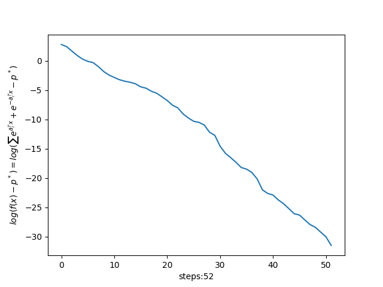

# 凸分析与优化方法 作业13
>2100011025 王奕博
## 第一题
本问在上一次作业的基础上，将下降方向改为梯度的最大分量，即l-∞范数下的最速下降方向。

计算最速下降方向的伪代码为：


这里，选取的参数为
>m=10\
n=5\
eta=1e-6

经过调参后发现，最优的超参数alpha和beta为（精确到0.1）：
>alpha=0.3\
beta=0.8

下降曲线如下图所示：



可以看出，这里的l-∞最速下降法表现得很好，达到了和梯度下降相似甚至更好的性能。

## 第二题

本题严格按照要求对目标函数，分别用damped newton method和gauss newton method方法进行优化。其中，每一步迭代的代码如下：
### damped newton method
```python
def step_damped(self):
        start = time.perf_counter()

        t = 1.0
        df = self.df(self.x)
        dx = -np.linalg.inv(self.ddf(self.x)) @ df
        dfdf = np.dot(df, df)

        cur = self.f(self.x)
        self.f_his.append(cur)

        end = time.perf_counter()
        self.total_time += end - start
        self.time_his.append(self.total_time)

        if dfdf < self.eta * self.eta:
            return False
        while self.f(self.x + t * dx) > cur + self.alpha * t * np.dot(df, dx):
            t = self.beta * t
        self.x += t * dx
        return True
```

### gauss newton method
```python
def step_gauss(self):
        start = time.perf_counter()

        j = self.jx(self.x)
        jj = np.linalg.inv(j.T @ j) @ j.T
        dx = -jj @ self.rx(self.x)
        df = self.df(self.x)
        cur = self.f(self.x)

        self.f_his.append(cur)

        end = time.perf_counter()
        self.total_time += end - start
        self.time_his.append(self.total_time)

        dfdf = np.dot(df, df)
        if dfdf < self.eta * self.eta:
            return False
        self.x += dx
        return True
```
其中返回值是为了判断迭代是否终止。

分别选取的超参数为：
### damped newton method

```
alpha=0.5
beta=0.8
```

### gauss newton method
(由于gauss newton方法只要两步就能收敛，因此难以说哪个是最优的参数。)
```
alpha=0.5
beta=0.5
```

分别以迭代次数和时间为横轴做图，结果如下：
### damped newton method


### gauss newton method


