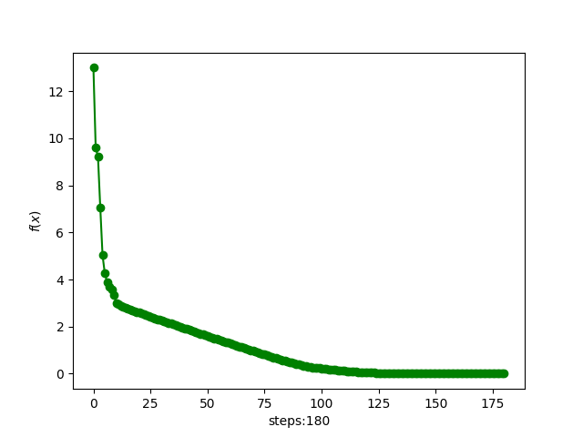
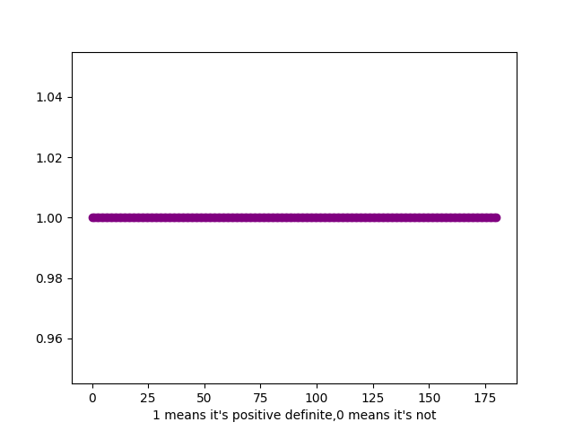
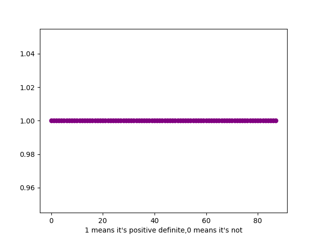

# 凸分析与优化方法 代码报告 作业14

> 2100011025 王奕博

## 第一题

题目要求使用conjugate gradient方法解决extended Rosenbrock function问题，并分别采用 the Hestenes-Stiefel formula, the Polak-Ribiere formula, the Fletcher-Reeves formula来解决。

将代码的最关键部分，即每次的迭代部分，展示如下：

```python
def cg_step(self, method):
    print(self.x, file=fl)
    t = 1.0
    g = self.df(self.x)
    dfdf = np.dot(g, g)
    if dfdf < self.eta * self.eta:
        return False
    f = self.f(self.x)
    d = None
    if self.first_time:
        d = -g
    else:
        beta = 1
        if method == "Hestenes-Stiefel":
            assert np.dot(self.d, g - self.g) != 0
            beta = np.dot(g, g - self.g) / np.dot(self.d, g - self.g)
        elif method == "Polak-Ribiere":
            beta = np.dot(g, g - self.g) / np.dot(self.g, self.g)
        elif method == "Fletcher-Reeves":
            beta = np.dot(g, g) / np.dot(self.g, self.g)
        d = beta * self.d - g
    while self.f(self.x + t * d) > f + self.alpha * t * np.dot(g, d):
        t = self.beta * t

    self.x += t * d
    self.d = d
    self.g = g

    self.f_his.append(f)
    self.time_his.append(time.time() - self.start_time)
    self.first_time = 0
    return True
```

所选取的超参数为：
```
alpha=0.8
beta=0.5
```

将下降结果画图，三种方法分别为：

### Hestenes-Stiefel：


### Polak-Ribiere


### Fletcher-Reeves


### 第二题

作业要求用dfp算法优化目标函数，并分别从两个初始点[0,0]和[1.5,1]开始迭代。

将代码的最关键部分，即每次的迭代部分，展示如下：
```python
def dfp_step(self):
    pass
    print(self.x, file=fl)
    alpha = 1.0
    g = self.df(self.x)
    dfdf = np.dot(g, g)
    if dfdf < self.eta * self.eta:
        return False
    f = self.f(self.x)
    d = -self.H @ g

    while self.f(self.x + alpha * d) > f + self.alpha * alpha * np.dot(g, d):
        alpha = self.beta * alpha
    dx = alpha * d
    self.x += dx

    dg = self.df(self.x) - g

    assert np.dot(dx, dg) != 0
    assert np.dot(dg, self.H@dg) != 0
 
    self.H += np.outer(dx, dx)/np.dot(dx, dg)-np.outer(self.H@dg, self.H@dg)/np.dot(dg, self.H@dg)

    self.d = d
    self.g = g

    self.f_his.append(f)
    self.time_his.append(time.time() - self.start_time)

    return True
```

从[0,0]点迭代的结果如下：


收敛的局部最小点为：
[-1,0]

从[1.5,1.0]点迭代的结果如下：


收敛的局部最小点为：
[1,2]

## 第四题

题目要求分别用dfp与bfgs方法优化目标函数，并比较正定性。

dfp方法上面已经解释过，就不再展示。bfgs的迭代关键步骤如下：
```python
def bfgs_step(self):
    alpha = 1.0
    g = self.df(self.x)
    dfdf = np.dot(g, g)
    if dfdf < self.eta * self.eta:
        return False
    f = self.f(self.x)
    d = -self.H @ g

    while self.f(self.x + alpha * d) > f + self.alpha * alpha * np.dot(g, d):
        alpha = self.beta * alpha
    dx = alpha * d
    self.x += dx

    dg = self.df(self.x) - g
    Hdg = self.H @ dg
    dgdx = np.dot(dg, dx)
    Hdgdx = np.outer(Hdg, dx)
    assert dgdx != 0

    self.H += (1 + np.dot(dg, Hdg) / dgdx) / dgdx * np.outer(dx, dx) - (Hdgdx + Hdgdx.transpose()) / dgdx

    self.d = d
    self.g = g

    self.f_his.append(f)
    self.time_his.append(time.time() - self.start_time)

    return True
```

用dfp法下降的图像为：


用bfgs法下降的图像为：


将正定性画在图中，0代表不正定，1代表正定，dfp的正定图像为：



bfgs的正定图像为：



可以看出，在这个初始值下，两种方法都是始终正定的。
