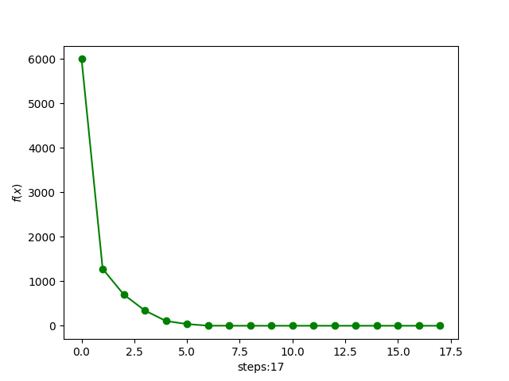

# 凸分析与优化方法 代码报告 作业15

> 2100011025 王奕博

本次要求使用limited memory bfgs算法来对目标函数进行优化。

为了模拟limited memory，这里对存储的历史进行限制。具体在于，定义了
```python
self.memory = [[None, None] for i in range(m_size)]
```
作为模拟存储内存的方式，并通过函数
```python
def update(self, x, g):
    self.memory.pop(0)
    self.memory.append([x, g])
```
来模拟更新内存，每当要增加一个记录，就要删除最久远的存储记录。

于是，每次更新对应的函数如下：
```python
def l_bfgs_step(self):
    print(self.x)
    g = self.df(self.x)
    if self.k != 0:
        self.update(self.dx_temp, g - self.dg_temp)
    dfdf = np.dot(g, g)
    if dfdf < self.eta * self.eta:
        return False
    f = self.f(self.x)
    self.f_his.append(f)
    # calc H_k^0. there is no need to write it in matrix form.
    gamma = 1.0
    if self.k != 0:
        gamma = np.dot(self.get_g(0), self.get_x(0)) / np.dot(self.get_g(0), self.get_g(0))
    # loop 1
    alpha_his = []
    q = g.copy()
    for i in range(min(self.m_size, self.k)):
        alpha = np.dot(self.get_x(i), q) / np.dot(self.get_x(i), self.get_g(i))
        q = q - alpha * self.get_g(i)
        alpha_his.append(alpha)
    # p <== q
    p = gamma * q
    # loop 2
    for i in range(min(self.m_size, self.k)-1, -1, -1):
        beta = np.dot(self.get_g(i), p) / np.dot(self.get_x(i), self.get_g(i))
        p = p + (alpha_his[i] - beta)*self.get_x(i)
    d = -p
    # line search
    t = 1.0
    while self.f(self.x + t * d) > f + self.alpha * t * np.dot(g, d):
        t = self.beta * t
    dx = t * d
    # update memory
    self.x += dx
    self.dx_temp = dx
    self.dg_temp = g
    self.k += 1
    return True
```

这里，取函数中的alpha为0.5，并令线搜索中的超参数为
```
alpha=0.5
beta=0.5
```
取最大存储量为30，函数的下降结果为：
```
[-1. -1. -1. ... -1. -1. -1.]
[ 0.   -0.75  0.   ... -0.75  0.   -0.75]
[ 0.3353322  -0.60959457  0.3353322  ... -0.60959457  0.3353322
 -0.60959457]
[ 0.65953224 -0.23971252  0.65953224 ... -0.23971252  0.65953224
 -0.23971252]
[0.80874908 0.27769219 0.80874908 ... 0.27769219 0.80874908 0.27769219]
[0.84271576 0.54553567 0.84271576 ... 0.54553567 0.84271576 0.54553567]
[0.9559648  0.90059875 0.9559648  ... 0.90059875 0.9559648  0.90059875]
[0.97930513 0.94356729 0.97930513 ... 0.94356729 0.97930513 0.94356729]
[0.99950597 0.99764105 0.99950597 ... 0.99764105 0.99950597 0.99764105]
[0.99969581 0.99884168 0.99969581 ... 0.99884168 0.99969581 0.99884168]
[0.99999921 0.99999847 0.99999921 ... 0.99999847 0.99999921 0.99999847]
[0.99999961 0.99999924 0.99999961 ... 0.99999924 0.99999961 0.99999924]
[0.99999981 0.99999962 0.99999981 ... 0.99999962 0.99999981 0.99999962]
[0.9999999  0.99999981 0.9999999  ... 0.99999981 0.9999999  0.99999981]
[0.99999995 0.99999991 0.99999995 ... 0.99999991 0.99999995 0.99999991]
[0.99999998 0.99999995 0.99999998 ... 0.99999995 0.99999998 0.99999995]
[0.99999999 0.99999998 0.99999999 ... 0.99999998 0.99999999 0.99999998]
[0.99999999 0.99999999 0.99999999 ... 0.99999999 0.99999999 0.99999999]
[1. 1. 1. ... 1. 1. 1.]
```
将函数值作图，结果为：


接下来，限制最大存储量为5，程序运行结果为：
```
[-1. -1. -1. ... -1. -1. -1.]
[ 0.   -0.75  0.   ... -0.75  0.   -0.75]
[ 0.3353322  -0.60959457  0.3353322  ... -0.60959457  0.3353322
 -0.60959457]
[ 0.65953224 -0.23971252  0.65953224 ... -0.23971252  0.65953224
 -0.23971252]
[0.80874908 0.27769219 0.80874908 ... 0.27769219 0.80874908 0.27769219]
[0.84271576 0.54553567 0.84271576 ... 0.54553567 0.84271576 0.54553567]
[0.9559648  0.90059875 0.9559648  ... 0.90059875 0.9559648  0.90059875]
[0.97946323 0.94359404 0.97946323 ... 0.94359404 0.97946323 0.94359404]
[0.99953896 0.99849466 0.99953896 ... 0.99849466 0.99953896 0.99849466]
[0.99964291 0.9993171  0.99964291 ... 0.9993171  0.99964291 0.9993171 ]
[0.99982559 0.99966531 0.99982559 ... 0.99966531 0.99982559 0.99966531]
[0.9999128  0.99983264 0.9999128  ... 0.99983264 0.9999128  0.99983264]
[0.9999564  0.99991631 0.9999564  ... 0.99991631 0.9999564  0.99991631]
[0.9999782  0.99995816 0.9999782  ... 0.99995816 0.9999782  0.99995816]
[0.9999891  0.99997908 0.9999891  ... 0.99997908 0.9999891  0.99997908]
[0.99999455 0.99998954 0.99999455 ... 0.99998954 0.99999455 0.99998954]
[0.99999727 0.99999477 0.99999727 ... 0.99999477 0.99999727 0.99999477]
[0.99999864 0.99999738 0.99999864 ... 0.99999738 0.99999864 0.99999738]
[0.99999932 0.99999869 0.99999932 ... 0.99999869 0.99999932 0.99999869]
[0.99999966 0.99999935 0.99999966 ... 0.99999935 0.99999966 0.99999935]
[0.99999983 0.99999967 0.99999983 ... 0.99999967 0.99999983 0.99999967]
[0.99999991 0.99999984 0.99999991 ... 0.99999984 0.99999991 0.99999984]
[0.99999996 0.99999992 0.99999996 ... 0.99999992 0.99999996 0.99999992]
[0.99999998 0.99999996 0.99999998 ... 0.99999996 0.99999998 0.99999996]
[0.99999999 0.99999998 0.99999999 ... 0.99999998 0.99999999 0.99999998]
[0.99999999 0.99999999 0.99999999 ... 0.99999999 0.99999999 0.99999999]
[1.         0.99999999 1.         ... 0.99999999 1.         0.99999999]
[1. 1. 1. ... 1. 1. 1.]
```
将函数值作图，结果为：


可以看出，存储量越大，在下降时对下降方向的估计就越准，因而算法迭代次数就越少。然而，存储量大会直接造成函数运行时间增加，因此要在这两者中做好取舍。
