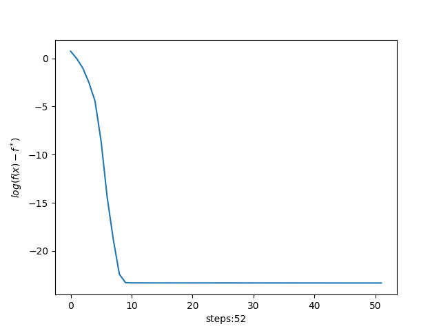
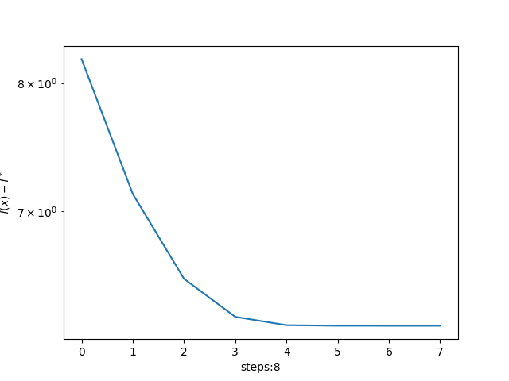
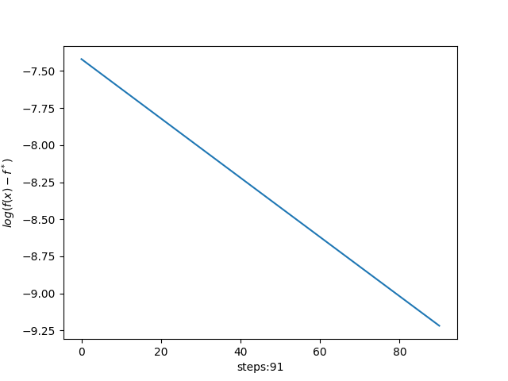
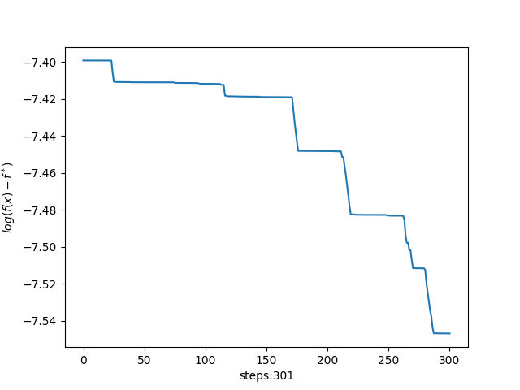
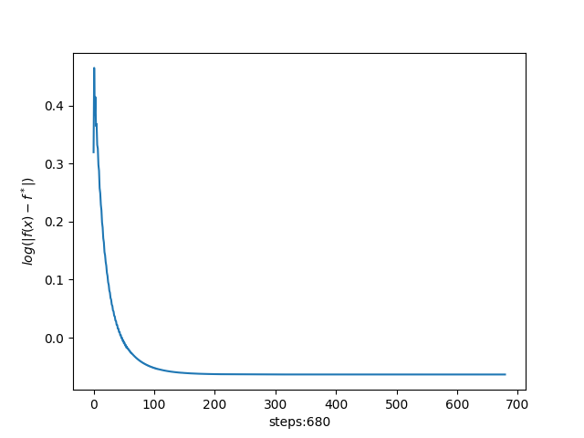
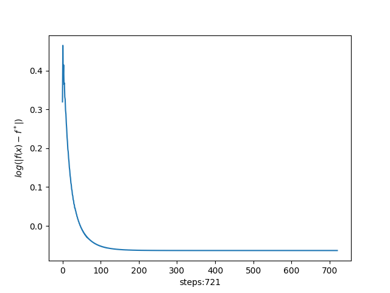

# 凸分析与优化方法 作业17 代码报告
> 2100011025 王奕博
## 第一题：含线性约束的log-sum-exp函数的优化问题

在本问中，对含有线性约束Ax=b的log-sum-exp函数分别采用了Direct projected gradient,Damped Newton’s method with equality constraint,Eliminate equality constraint以及Dual approach进行求解，并比较了这些方法之间的差异与性能。

### Direct projected gradient
采用Direct projected gradient时，每次迭代先求一次梯度，然后进行投影。投影的时候使用最小二乘公式，即：
```python
def projection(self, x: np.array, A: np.array):
    return x - A.T @ np.linalg.inv(A @ A.T) @ A @ x
```

### Damped Newton’s method with equality constraint
采用牛顿法时，梯度是通过解一个较大的线性方程组得到的，核心步骤如下：
```python
    N_upper = np.concatenate([ddf, self.A.T], axis=1)
    N_lower = np.concatenate([self.A, np.zeros((self.p, self.p))], axis=1)
    N = np.concatenate([N_upper, N_lower], axis=0)
    r = np.concatenate([-df, np.zeros(self.p)])
    dxw = np.linalg.solve(N, r)
    dx = dxw[:500]
```
先通过concatenate函数拼接出N，之后使用numpy.linalg包进行求解。
### Eliminate equality constraint
通过将原问题转化为无约束优化问题进而求解。

转化之后的函数变为f(Fx+z),其中，z,F通过类似最小二乘的方法求得，即：
```python
    self.z = A.T @ np.linalg.inv(A @ A.T) @ b
    self.F = np.identity(n) - A.T @ np.linalg.inv(A @ A.T) @ A
```
### Dual approach
分别更新Lagrangian和Lagrange multiplier。在更新Lagrange multiplier时，由于每次的更新率gamma取的是定值，因此收敛效果其实并不好，非常慢。

### 数值结果
<table>
    <tr>
        <td ><center>Direct projected gradient </center></td>
        <td ><center>Damped Newton’s method  </center></td>
    </tr>
    <tr>
        <td><center>Eliminate equality constraint </center></td>
        <td ><center>Dual approach</center> </td>
    </tr>
</table>

### 效果比较
Direct projected gradient的效果非常稳定，几乎和无约束下梯度下降的收敛模式相同。然而，它的不足之处在于：1.初始值必须在约束范围以内，这需要一定的计算量；2.每次计算需要额外计算一个矩阵乘法，虽然这个计算量不大，但是如果约束不为线性的话，这一步的计算量可能难以接受。

Newton法收敛速度非常快，不到十次就可以收敛。然而，在每次计算时，不但要计算二阶导数，还要求解一个很大的线性方程组，这里的计算量相较于一阶算法来说非常的大。

Eliminate equality constraint实质上是把问题转化为了一个无约束优化问题，因此下降的非常稳定，和普通的梯度下降法很类似。

Dual approach在这里表现的效果并不好，这是因为对于gamma的选取是确定的，因此在优化Lagrange multiplier lambda时表现得非常不令人满意。同时，由于这里的程序逻辑存在“二阶循环”的问题，因此导致每一次迭代的速度很慢。


## 第二题：含线性约束的二范数优化问题的罚函数方法

在本题中，对含有线性约束Ax=b的||x||_2函数实现了罚函数优化方法，分别通过absolute-value penalty function和Courant-Beltrami penalty function对原函数进行了梯度下降。

首先，此优化问题有closed-form解，这可以通过代码
```python
self.x_opt = self.A.T @ np.linalg.inv(self.A @ self.A.T) @ self.b
```
求出。我们将这个解作为计算log(f-f^*)的方式，并且将程序停止的判断标准设置为：当x和x_opt足够接近的时候，程序停止运行。

此外，由于罚函数和||x||_2都为线性增长，因此在迭代时会出现前期收敛较慢的情况。因此，我将目标函数改为(||x||_2)^2，它的最优值点和原来相同，且经过实验发现收敛速度得到很大提升。

### absolute-value penalty function

在这里，罚函数选择的是Ax-b的每一项绝对值求和，即1-norm。因此，其导数由以下式子算出：
```python
def dq_abs(self, x: np.array):
    return x + self.gamma * self.A.T @ np.sign(self.A @ x - self.b)
```
接下来进行梯度下降。

### Courant-Beltrami penalty function

CB罚函数是二次函数，因此与也为二次函数的目标函数相加之后，仍然为二次函数。该函数的导数为：

```python
def dq_cb(self, x: np.array):
    return x + self.gamma * 2 * self.A.T @ np.sign(self.A @ x - self.b)
```
### 一些技巧

通过实验发现，如果选取固定的gamma，则函数收敛较慢，并且收敛的值与目标值差别较大。因此，我进行了以下的操作:

当迭代一定次数的梯度下降之后，如每做10次迭代之后，将gamma加上固定的数值。实验发现这个技巧提高了算法的收敛速度，并使得程序的稳定性有很大提升。

### 实验结果

在这里，线性搜索的相关参数选取是alpha=0.5,beta=0.8，惩罚函数前的系数gamma开始时为10，之后每次迭代增加5。

<table>
    <tr>
        <td ><center>absolute value penalty function </center></td>
        <td ><center>Courant-Beltrami penalty function</center></td>
    </tr>
</table>

在这组参数下，到达相同的精度absolute value方法所需的迭代次数略微少一些。此外，通过图像可以看出，两者的收敛方式很接近。

