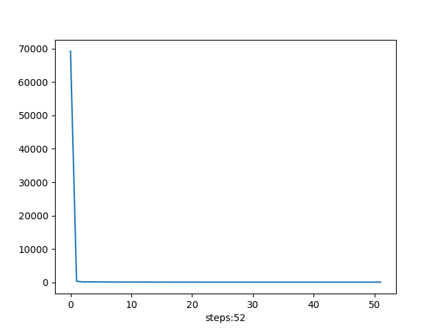
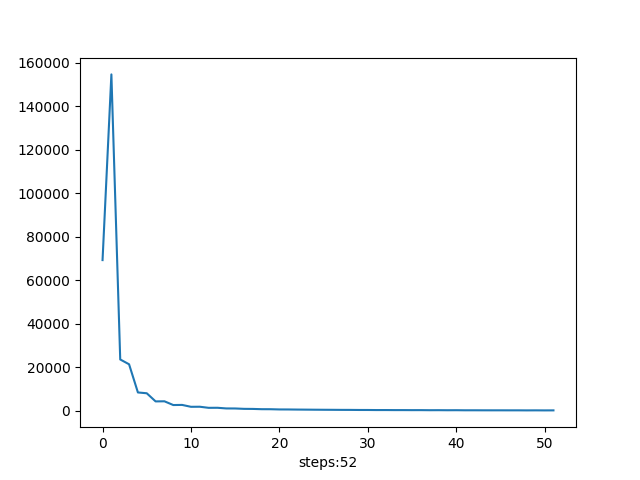
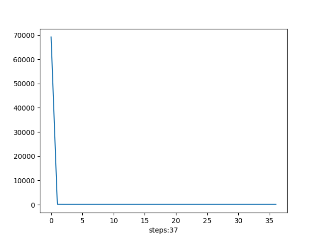
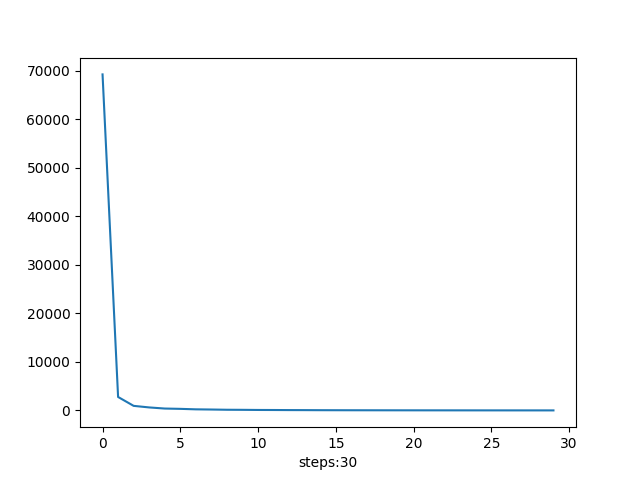
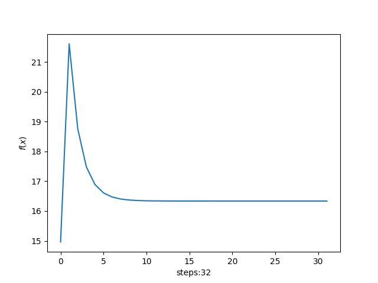
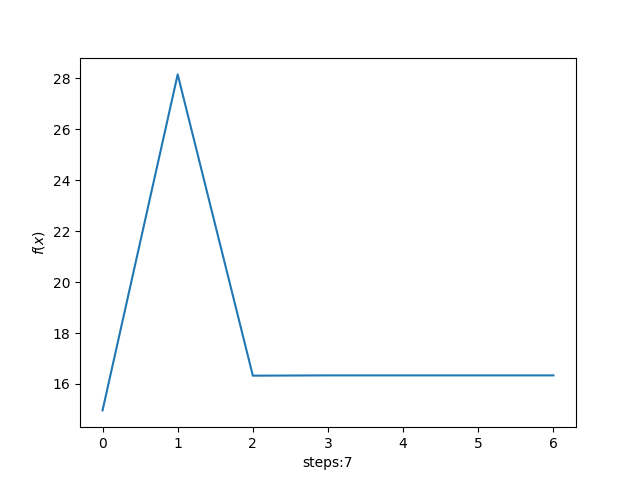
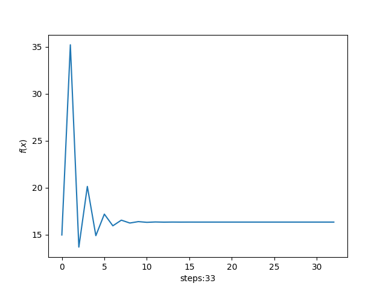
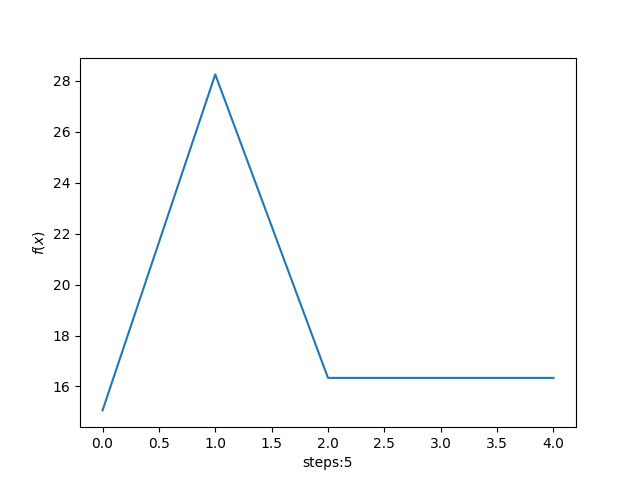
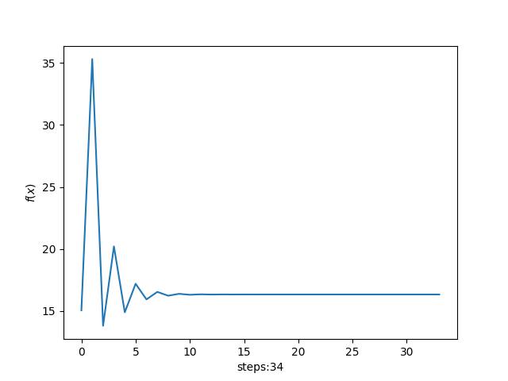

# 凸分析与优化方法 作业18
> 2100011025 王奕博

## Frank-Wolfe Algorithm

本问要求对含有范数约束的 ||Ax-y|| 的优化问题，分别使用Frank-Wolfe算法与投影梯度下降法进行求解。

本问的范数约束特性使得在使用F-W算法时，进行选取内积与梯度最小的s值时计算非常方便。同时，在进行投影梯度下降法时，对x的投影的计算也很容易实现。因此，这两种方法是非常适合求解本问的方法。

本问使用F-W算法的每次迭代代码如下（只保留关键部分）：
```python
    def step(self, method: str):
        if method == "inf":
            g = self.df(self.x)
            s = -np.sign(g)
            gamma = 2/(self.k+2)
            dx = gamma*(s-self.x)
            self.x += dx
            self.k += 1
        elif method == "1":
            g = self.df(self.x)
            s = np.zeros_like(g)
            max_index = np.argmax(np.abs(g))
            s[max_index] = -np.sign(g[max_index])
            gamma = 2/(self.k+2)
            dx = gamma*(s-self.x)
            self.x += dx
            self.k += 1
```

这里是按照标准的F-W算法流程进行，其中，在计算使得<s,dx>最小的s的值时，可以有closed-form解，具体如下：

当选取1范数时，由线性规划相关知识，s应当在x绝对值最大的分量处取1或者-1，其它地方取0；

当选取无穷范数时，则s取 -np.sign(x),即在x分量为正时取-1，为负时取1，这样可以充分达到最值。

对于本问要求的projection gradient descend方法，关键的迭代代码如下（依然只保留关键部分）：
```python
    def step(self, method: str):
        if method == "inf":
            g = self.df(self.x)
            d = -g
            t = self.line_search(self.x, d)
            x = self.x + t*d
            x = x/np.linalg.norm(x, np.inf)
            dx = x-self.x
            self.x = x
        elif method == "1":
            g = self.df(self.x)
            d = -g
            t = self.line_search(self.x, d)
            x = self.x + t*d
            x = x/np.linalg.norm(x, 1)
            dx = x-self.x
            self.x = x
```

### 测试结果

将两种算法运行足够的时间，可以发现都会收敛于最优值。

由于两种算法在每一次迭代的计算量不同，故直接比较迭代次数没有意义。在这里，我们将两种算法同时运行相同时间，比较两者的效率和特性。

<table>
    <tr>
        <td ><center>frank-wolfe_1_norm.png </center></td>
        <td ><center>frank-wolfe_inf_norm.png </center></td>
    </tr>
    <tr>
        <td ><center>gradient_descend_1_norm.png </center></td>
        <td ><center>gradient_descend_inf_norm.png </center></td>
    </tr>
</table>

由运行结果可以比较出，虽然在迭代相同步数的情况下projection gradient descend的下降效率更高，然而由于projection gradient descend的每一步要通过线搜索确定步长，因此每一步的运行时间较慢。相比之下，F-W算法每一步的步长是确定的，故虽然每一步的效率不如projection gradient descend方法，但是运行每一步的耗时远小于projection gradient descend。总体来看，F-W的效率高于projection gradient descend，并且在某些参数下projection gradient descend收敛效果很差，而F-W算法则相对稳定。

## ADMM

题目中对目标函数||x-a||_2+||y-b||_1进行优化，并考虑是否能够使用dual ascend方法。我认为在这里不能够使用dual ascend方法，理由如下：

1.如果lagrange multiplier **lambda** < 1,那么，容易证明，分别对x和y进行优化的话，Lagrangian的极小值分别在x=a和y=b处取得。因此，这时对x和y进行更新是毫无意义的。

2.如果lagrange multiplier **lambda** > 1，那么，Lagrangian将趋于负无穷，此时函数无界。

因此，如果要使用dual ascend,需要将**lambda**控制在很小范围内，这对于数值算法来说很难实现，尤其是对于**lambda**的更新是非常机械的。我做了一些实验，发现函数的lagrangian总是滑向负无穷。

相比之下，ADMM加上了形式为二次函数的惩罚项，这避免了Lagrangian趋于无穷的情况。并且，加上惩罚项之后，lagrangian对于x和y的最小值有closed form解，即将proximal函数作用于其上。这个解的形式如下(展示迭代的代码)：

对于x:

```python 
    def step_x(self):
        d = self.y - (self.lam)/self.beta - self.a
        dist = np.linalg.norm(d, 2)
        self.x = self.a + (dist-self.beta)*d/dist
```

对于y:

```python
    def step_y(self):
        b = self.x+self.lam/self.beta
        y_hat = np.zeros_like(self.y)
        a = self.b
        coe = b-a
        # soft threshold
        for i in range(100):
            if coe[i] < -1/self.beta:
                y_hat[i] = coe[i]+1/self.beta
            elif coe[i] > 1/self.beta:
                y_hat[i] = coe[i]-1/self.beta
            else:
                y_hat[i] = 0
        self.y = y_hat+a
```

迭代发现算法可以快速的收敛于最优解。
### 测试结果
对于9组不同的(beta,tau)组合，它们的计算结果如下：

<table>
    <tr>
        <td ><center>beta=0.1, tau=0.5 </center></td>
        <td ><center>beta=0.1, tau=1.0 </center></td>
        <td ><center>beta=0.1, tau=1.5 </center></td>
    </tr>
    <tr>
        <td ><center>beta=0.01, tau=0.5 </center></td>
        <td ><center>beta=0.01, tau=1.0 </center></td>
        <td ><center>beta=0.01, tau=1.5 </center></td>
    </tr>
    <tr>
        <td ><center>beta=0.001, tau=0.5 </center></td>
        <td ><center>beta=0.001, tau=1.0 </center></td>
        <td ><center>beta=0.001, tau=1.5 </center></td>
    </tr>
</table>

可以看出，对于0.1, 0.01, 0.001的beta值，算法都能稳定的收敛到最优值。同时，当迭代步长为beta时，函数收敛的最快；步长为0.5beta时，函数收敛的较慢；当步长为1.5beta时，函数每一次迭代“步子过大”，导致收敛时展示出了一定的震荡现象。因此，在这个优化问题中，取tau=1是更好的选择。