# 凸分析与优化方法 HW19
>2100011025 王奕博

## problem 1: LADMAP for graph construction problem

本问要求使用LADMAP优化一个graph construction problem问题。

首先，这是一个线性约束下的凸优化问题，且目标函数可分，因此通过将两个约束竖直排列，可以将该问题的约束写为线性等式的标准形式，即A_1(Z)+A_2(E)=B。这里B=D,A_1是D和横排的全一向量竖直拼接得到的矩阵，A_2是单位矩阵和横排的全零向量拼接得到的矩阵。

并且，由目标函数的两个部分，nuclear norm和2,1-norm的形式都较为简单，可以发现它们经过proximal算子运算后的结果存在closed form形式解。因此，在每次迭代之后，可以直接运算得到每次迭代结果，而不需要进行梯度下降来逼近。

对于Z，nuclear norm的proximal结果为（用代码表示）：
```python
    def prox_1(self, Z, beta):
        U, Sigma, VT = np.linalg.svd(Z)
        Sigma = np.maximum(Sigma - 1/beta, np.zeros_like(Sigma))
        return U @ np.diag(Sigma) @ VT
```
对于E，2,1-norm的proximal结果为（用代码表示）：
```python
    def prox_2(self, E, beta):
        Xv = np.linalg.norm(E, ord=2, axis=0)
        P = np.zeros_like(E)
        for i in range(P.shape[1]):
            P[:, i] = max((1 - self.lam_coe / (beta * Xv[i])), 0) * E[:, i]
        return P
```
于是，更新Z，E变量的步骤如下：

```python
    def step_Z(self):
        W = self.Z - (1 / (self.beta * self.eta1)) * self.A1.T @ (self.LAM + self.beta * (self.A1 @ self.Z + self.A2 @ self.E - self.B))
        Z = self.prox_1(W, self.beta * self.eta1)
        self.dZ = Z-self.Z
        self.Z = Z.copy()

    def step_E(self):
        W = self.E - (1 / (self.beta * self.eta2)) * self.A2.T @ (self.LAM + self.beta * (self.A1 @ self.Z + self.A2 @ self.E - self.B))
        E = self.prox_2(W, self.beta * self.eta2)
        self.dE = E-self.E
        self.E = E.copy()
```

在更新结束之后，要更新lagrangian multiplier.在这里multiplier是一个矩阵，用变量LAM存储，其更新为：
```python
    def step_LAM(self):
        self.LAM += self.beta * (self.A1 @ self.Z + self.A2 @ self.E - self.B)
```
最后，更新参数beta的运算过程如下：
```python
    def step_beta(self):
        rho = 1
        temp = self.beta * max(np.sqrt(self.eta1) * np.linalg.norm(self.dZ), np.sqrt(self.eta2) * np.linalg.norm(self.dE)) / np.linalg.norm(self.B)
        if temp < self.eps2:
            rho = self.rho
        self.beta = min(self.beta_m, self.beta*rho)
```
将以上步骤合起来，就是完整的一次迭代。
### 数值结果

下图是目标函数值随迭代次数的曲线：


.png)


下图是函数约束大小随着迭代次数的曲线（通过对约束的值取norm得到，可以看出来其趋于0）：


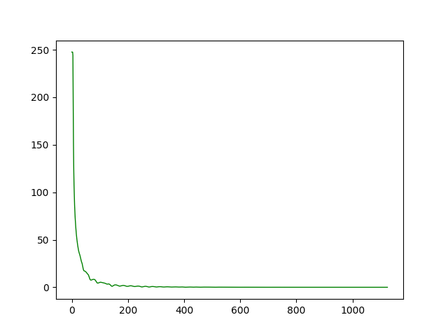


下图是参数beta自动更新的曲线：


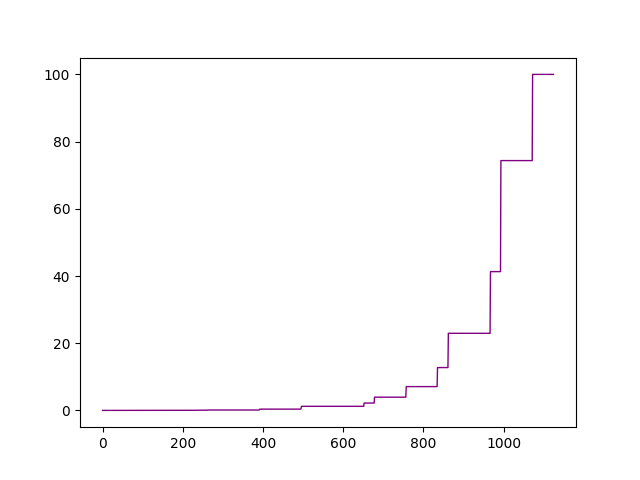


## problem 2: LADMPSAP for graph construction problem

LADPMPSAP许多步骤与LADMAP相似，如求proximal的部分以及更新lambda和beta的部分。

不同之处在于，LADMPSAP的更新Z和E的情况是可以并行化计算的。虽然由于硬件原因并没有将代码写成parallel的，但是可以预想如果能够并行化的话代码速度将提升许多。

此外，对参数eta的选择也相较于LADMAP更大。

### 数值结果

下图是目标函数值随迭代次数的曲线：


.png)


下图是函数约束大小随着迭代次数的曲线（通过对约束的值取norm得到，可以看出来其趋于0）：


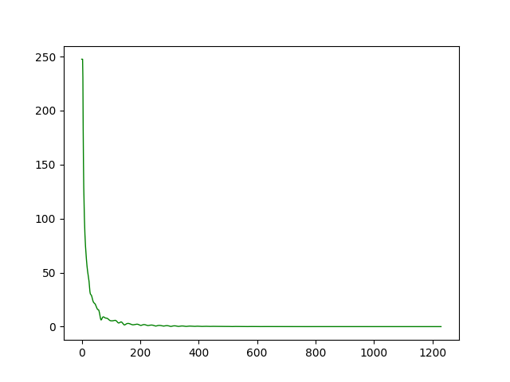


下图是参数beta自动更新的曲线：


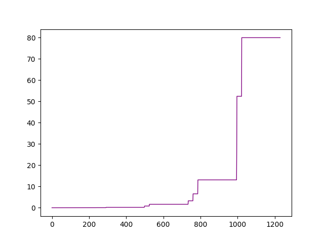


## problem 3: GD & pLADMPSAP for logistic regression

首先是证明目标函数梯度的Lipschitz常数。该证明如下：


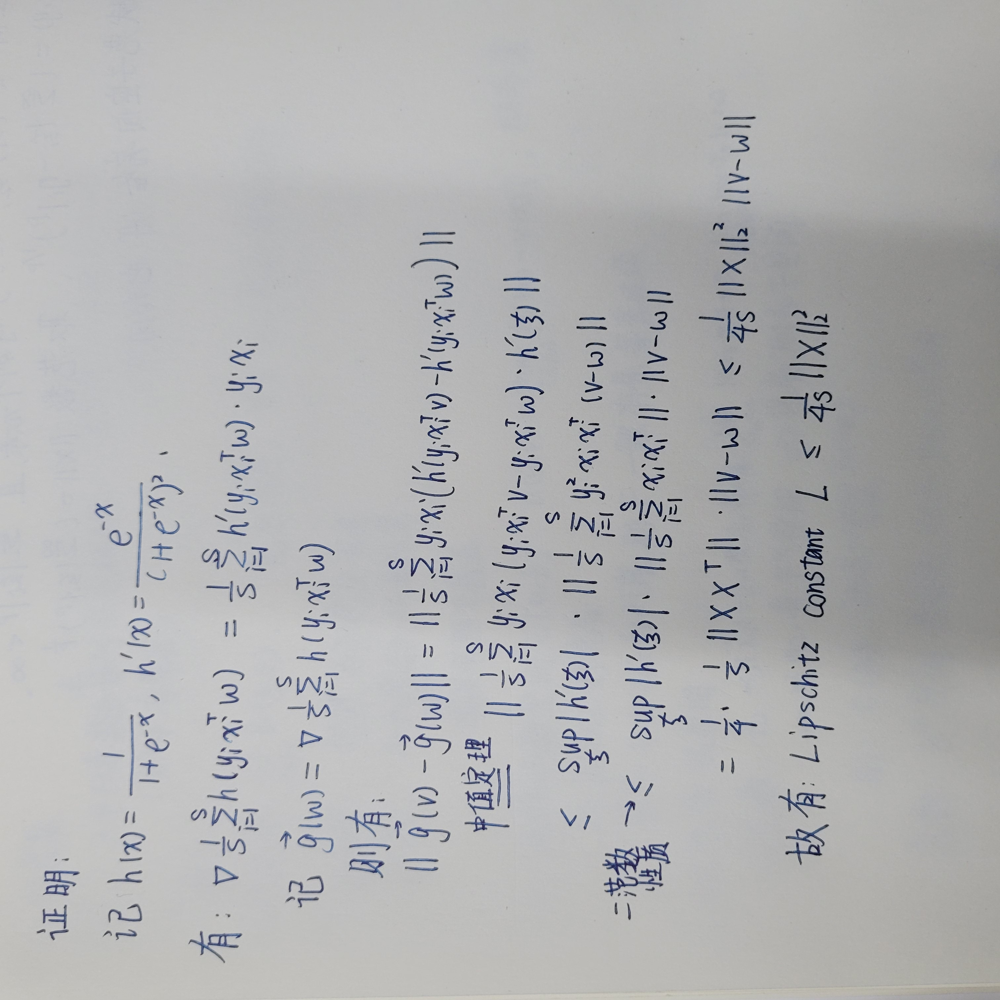

此后，分别用梯度下降和pLADMPSAP法来优化目标函数。由于梯度下降法之前已经写过很多次，故不再赘述。

将两种算法运行相同的时间，其结果如下：


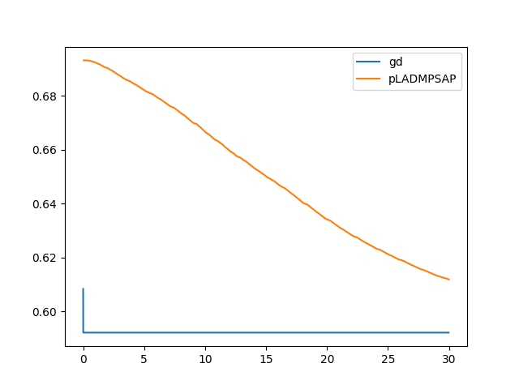

可以看出，梯度下降法在几次迭代之后就能收敛到最优值，而pLADMPSAP算法则要慢许多。然而，pLADMPSAP算法更适合大规模并行化计算，本问由于硬件原因只能写成串行版本，而在足够大的处理器上，可以将每次循环中的上百次迭代合并在一起运行，这样可以极大的提升算法速度。

此外，梯度下降法的梯度计算和线搜索都是精确的，并且每一次计算并不需要过长时间，而pLADMPSAP方法则经过了很多步线性化近似处理，并且由于目标函数的原因，对每个分量计算梯度并未节省太多时间，因此并没有体现出算法的优势。


## problem 4: block coordinate descent for dictionary learning

Block coordinate descent算法的特性，是每次对某些变量进行最小化处理，并循环这一过程。在这里，我将block选取为D的第i个纵向量和X的第i个横向量。

在每次更新时，我使用k-SVD方法进行更新。关于这个算法的细节证明，可以见文章"K-SVD: An Algorithm for Designing Overcomplete Dictionaries for Sparse Representation". 该算法的大致思路为，如果固定其它变量，只对 d_i 和 x_i 进行优化的话，那么该优化存在closed form解。

这个closed form形式解需要先对“残余”的矩阵进行SVD分解，然后 d_i 取一个特征向量，x_i 取一个特征向量乘以最大奇异值后做soft threshold之后的值，具体证明见上述文章（因为有点长，写不下）。

具体的更新步骤可以见以下代码：
```python
    def step(self, i):
        # use K-SVD and low-rank approximation algorithm.
        # see article "K-SVD: An Algorithm for Designing Overcomplete Dictionaries for Sparse Representation"
        d = self.D[:, i]
        x = self.X[i, :]
        E = self.Y-self.D@self.X+np.outer(d, x)
        U, S, V = np.linalg.svd(E)
        d_opt = U[:, 0]
        x_opt = V[0, :]*S[0]
        for j in range(x_opt.shape[0]):
            if x_opt[j] >= self.lam:
                x_opt[j] -= self.lam
            elif x_opt[j] <= self.lam:
                x_opt[j] += self.lam
            else:
                x_opt[j] = 0
        self.X[i, :] = x_opt
        self.D[:, i] = d_opt
        cur = self.f(self.X, self.D)
        self.f_his.append(cur)
```

这是对第i个分量进行更新的代码，在具体进行运算时，主程序对i进行循环，从而循环更新各个变量。

由于该迭代可以保证约束一直是紧的，因此这里只展示目标函数值随着迭代的曲线(该程序在每一轮循环中需要迭代400次，因此每轮循环都很慢。这里我们观察到迭代几轮后就会收敛)：


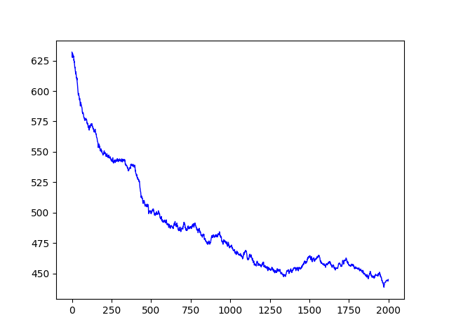


可以看出，每次迭代后函数值的震荡幅度很大。这也容易理解，因为每次是在对某个变量组做更新而非对全局做更新。

## problem 5: block coordinate descent for low-rank matrix completion

同上，在这里，我们选择的block不再是向量，而是整个矩阵U,V,A. 具体来说，我们依次更新U,V,A, 作为一次迭代的内容。

对于U和V来说，每次迭代是矩阵最小二乘问题，因此最小值有closed form解，可以用矩阵伪逆来表示。具体可见代码(pinv是np.linalg中的伪逆函数)：
```python
    self.U = self.A@np.linalg.pinv(self.V.T)
    self.V = (np.linalg.pinv(self.U)@self.A).T
```
之后更新A，显然，A在约束下的最小值满足：A在特定元素上和D相同，此外和UV^T相同。

因此，每一次更新步骤如下:

```python
    def set_mat(self):
        for pos in self.omega:
            self.A[pos[0]][pos[1]] = self.D[pos[0]][pos[1]]

    def step(self):
        self.U = self.A@np.linalg.pinv(self.V.T)
        self.V = (np.linalg.pinv(self.U)@self.A).T
        self.A = self.U@self.V.T
        self.set_mat()
```

目标函数值随着迭代次数的曲线如下：


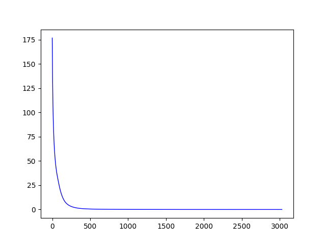

按照题目要求，做出“修复矩阵”A和“原矩阵”D的差异随着迭代次数的曲线，如下：


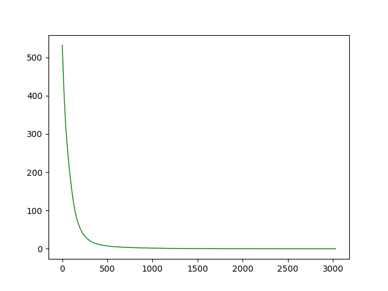

两者都可以以稳定的速度趋于0，这意味着该算法可以很好的“复原”低秩矩阵，即使是在只知道原矩阵D的10%的元素的情况下。

## problem 6: Parallel Projections Algorithm

算法如下：
```
while True:

    1.更新x: x 取为所有 y_i 的平均值

    2.对于i = 1,2,...,n (可以并行更新):

        更新y_i : y_i 为 x 到 X_i 的投影
```

用流程图表示：


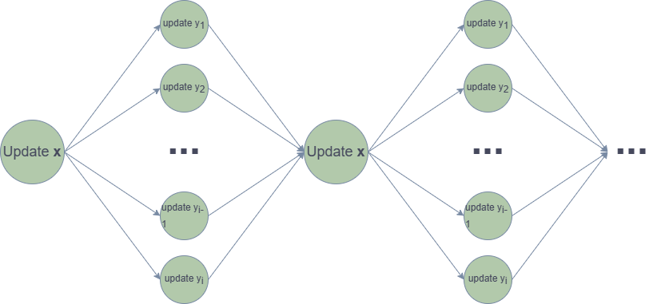

该算法会收敛到以下状态：
```
x 是所有 y_i 的“重心”， 同时所有 y_i 都是 x 到 X_i 的投影。
```

当 X_i 为二维圆盘时，x到X_i的投影很容易求出。因此每次迭代代码如下：

```python
def step_x(self):
        self.x = 0.2*np.sum(self.Y, axis=1)

    def step_y(self, i):
        y = self.Y[:, i]
        y0 = self.Y0[:, i]
        if np.linalg.norm(y-self.x, 2) < self.D[i]:
            y = self.x
        else:
            y = y0 + (self.x-y0) * self.D[i] / np.linalg.norm((self.x-y0), 2)
        self.Y[:, i] = y

    def start(self):
        while True:
            self.step_x()
            for i in range(5):
                self.step_y(i)
```

其目标函数值随迭代次数的曲线如下：


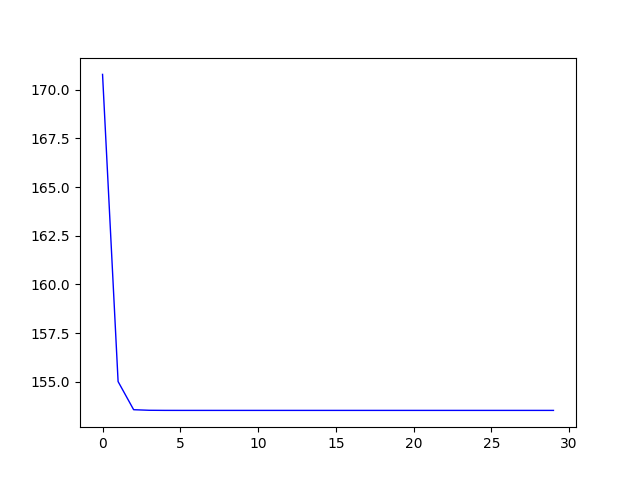

在该情境下，ppa收敛的非常迅速。