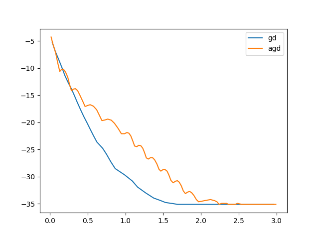

# 凸分析与优化方法 作业20
> 2100011025 王奕博

## problem 1: 随机算法

本问要求对logistic回归问题，采用八个随机算法来求解并比较性能。

### 1. SGD

SGD算法是最基础的随机梯度法，其步长的选择是随机选择一个梯度并乘以一个常数eta。

每一步迭代的关键代码如下：
```python
    def SGD_step(self, i):
        self.w -= self.df_i(self.w, i) * self.eta
```

### 2. Momentum

Momentum法在SGD的基础上加入了动量项，目的是使梯度下降更加稳定，缓解在等值线狭长处出现下降缓慢的情况。

每一步迭代的关键代码如下：
```python
    def Momentum_step(self, i):
        self.b = self.b*self.gamma + self.eta * self.df_i(self.w, i)
        self.w -= self.b
```

### 3. NAG
NAG法每一步的下降梯度并不在当前 w 处取得，而是在与其有一定距离处计算梯度，这是该算法的主要创新之处。

每一步迭代的关键代码如下：
```python
    def NAG_step(self, i):
        d = self.df_i(self.w - self.eta * self.b, i)
        self.b = self.b*self.gamma + self.eta * d
        self.w -= self.b
```

### 4. AdaGrad
AdaGrad方法不再固定eta值，而是通过计算选取较优的系数。

每一步迭代的关键代码如下：
```python
    def Adagrad_step(self, i):
        d = self.df_i(self.w, i)
        self.G[i] += np.dot(d, d)
        self.w -= self.eta_adagrad / np.sqrt(1e-8 + self.G[i]) * d
```

### 5. AdaDelta

AdaDelta方法不只是对 E[dw] 进行估计，还对 E[dw^2] 进行了估计。

每一步迭代的关键代码如下：
```python
    def Adadelta_step(self, i):
        d = self.df_i(self.w, i)
        self.Eg = self.gamma*self.Eg+(1-self.gamma)*d**2
        dw = np.sqrt(self.dwsq+1e-8) / np.sqrt(self.Eg+1e-8)*d
        self.dwsq = self.gamma*self.dwsq + (1-self.gamma)*dw ** 2
        self.w -= dw
```

### 6. Adam

Adam方法对 E[dw] ，E[dw^2] 进行了更精确的估计。

每一步迭代的关键代码如下：
```python
    def Adam_step(self, i):
        d = self.df_i(self.w, i)
        self.m = self.beta1 * self.m + (1 - self.beta1) * d
        self.v = self.beta2 * self.v + (1 - self.beta2) * d ** 2
        m_hat = self.m / (1 - self.beta1 ** (1+self.steps))
        v_hat = self.v / (1 - self.beta2 ** (1+self.steps))
        self.w -= self.eta / (np.sqrt(v_hat) + self.eps) * m_hat
```

### 7. Adan
Adan融合了以上各种方法的优点，使迭代更加精确、稳定性更强。

每一步迭代的关键代码如下：
```python
    def Adan_step(self, i):
        g = self.df_i(self.w, i)
        self.vk = (1-self.beta2)*self.vk+self.beta2*(g-self.gk)
        self.mk = (1-self.beta1)*self.mk+self.beta1*g
        self.uk = self.mk+(1-self.beta2)*self.vk
        self.nk = (1-self.beta3)*self.nk+self.beta3*(g+(1-self.beta2)*(g-self.gk))**2
        self.gk = g
        self.w = (1/(1+self.lam*self.eta))*(self.w-self.eta*self.uk/np.sqrt(self.nk+self.eps))
```

### 8. RCD

RCD方法和以上算法的思路都不太一样，它随机选取梯度的分量而非梯度的一部分作为迭代。因此，RCD每一步的下降花费计算量较大，但是每一次迭代下降幅度也较大。


### **比较**：

将所有算法运行相同长度的时间（10秒），将目标函数值随时间的图像画在同一张图上，如下：

.png)

可以看出，在这个问题中，RCD的效果是最好的，甚至远快于其它算法。为了看清其他算法的下降曲线，去掉RCD后其他算法的图像为：

.png)

在这里可以看出，三种基础的随机梯度下降法：SGD, Momentum, NAG效果不如其它几种进阶算法。

在adagrad, adadelta, adam, adan中，可以看出虽然其效果相似，但是融合其它各种算法优势的adan下降速度十分稳定。

## problem 2: 加速算法

同样是对于logistic回归问题，本问要求使用GD和AGD算法分别进行优化。

首先，考虑 N = 1 时，可以计算出其并非是 mu-strongly convex 的凸函数。因此，这里的AGD算法采用仅 L-smooth 的AGD算法。

AGD算法关键的迭代步骤如下：

```python
    def step(self):
        lam_old = self.lam
        v_old = self.v
        self.lam = (1+np.sqrt(1+4*self.lam**2))/2
        self.gamma = (1-lam_old)/self.lam
        df = self.df(self.w)
        self.v = self.w-df/self.beta
        self.w = (1-self.gamma)*self.v+self.gamma*v_old
```

将GD和AGD运行相同的时间，并将 log(f - f_opt) 的图像画在同一张图上，其结果如下：



可以看出，AGD的下降速度接近于一次收敛，并且较为稳定。并且，在开始的几步AGD的速度高于GD，然而当自变量接近于最优值时，AGD会下降不如gd，并在小范围内震动较强，这是随机算法的常见问题。